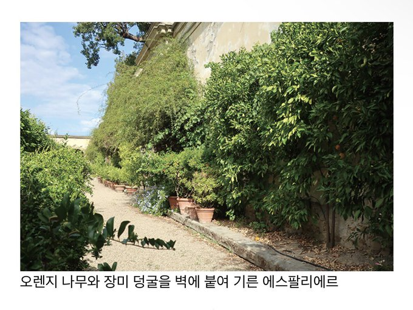

오늘날에는 주로 장식적으로 활용되지만 중-근세 유럽에서는 담장으로부터 방사되는 열을 활용하여 늦서리로부터 추위에 약한 과수의 꽃봉오리를 보호하고 과실의 숙기를 앞당기고자하는 실용적인 목적이 있었다. 또 과실을 따기도 보다 편리했고, 벽 꼭대기에 거적을 달면 월동을 위한 피복도 쉬웠다.

Espalier : 과실수를 정원 벽에 붙여 일정한 프레임을 따라 자라도록 가꾸는 원예 방식
