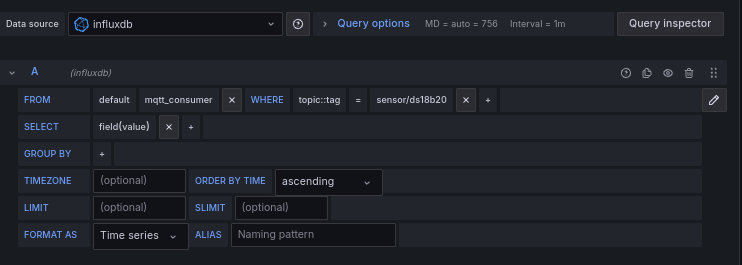
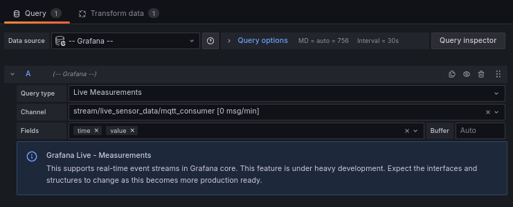
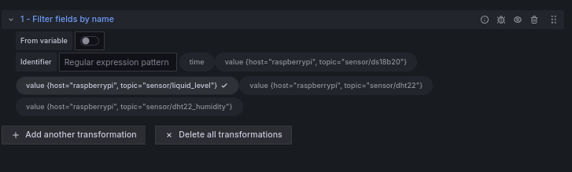

# Hanging Garden - Aquaponics & Aeroponics

This project involves four parts :

1. controltower: a Django web app dashboard for manual control and editing auto scheduler settings. Lives on Rapberry Pi.
2. (Auto) scheduler background job. Lives on Rapberry Pi.
3. Real-time monitoring: just a standard InfluxDB+Telegraf+Grafana stack with MQTT. Lives on Rapberry Pi.
4. Camera for environment monitoring: ESP32 server that streams camera data, can be opened on Raspberry Pi for ease of access.

# Architectural Decision & Philosophy

The project started off with a lack of requirements, while having a pressing deadline. Therefore I chose for a divide and conquer system design that would make it easier for teammates to QA and iterate quickly like a lean product development cycle. One mistake I made with this design is that I did not think too much about hardware QA - and that happened to be the major failing point for our team. However, the software system design itself worked smoothly.

Some factors I considered were:

- Everyone on the team used iPhone, and no one knew how to develop phone apps. I could work with a Django web app.
- Teammates need to be able to control and respond to abnoramlies anytime, anywhere; not just at the school. What's the point of making a smart system in-house only, if you are going to be there anyway to see it grow?
- However, I did not want to compromise on security by exposing a smart farm control system to outside.
- Arduino Uno R4 Wifi has issues with timers. So I am going to design in such a way that Arduino only communicates with Rapberry Pi to receive or publish information, but doesn't do any timezone or time related calculations.
- Since the temperatures and other sensors don't fluctuate dramatically, I don't have to worry too much about data granularity. After some testing, it seems I have to be more worried about sensors malfunctioning.

(Diagrams to be updated)

# Getting Started

I recommend setting up Raspberry Pi + Common first, then work on Arduino last.

## Common

1. Install RealVNC
2. Install Tailscale, make an account.

## Arduino

See https://github.com/microwavestine/k-digital-smart-farm/tree/main/arduino/mqtt

**Change mqtt_server to [raspberrypi_IP], and set SSID, passwords**

## Raspberry Pi

After doing the initial setup for Raspberry Pi, we need to enable ssh and vnc first for ease of access. `sudo rasp-config` then in `Interface Options`, enable VNC and SSH.

### Installing Tailscale

Installing tailscale on Raspberry Pi allows you to access it anywhere via Tailscale VPN network.

`curl -fsSL https://tailscale.com/install.sh | sudo bash`
`sudo tailscale up`

Then click on the login link to link raspberry pi to your account.

### Installing MQTT server

https://randomnerdtutorials.com/how-to-install-mosquitto-broker-on-raspberry-pi/

Follow through the first 1~6 steps. 

Then in /etc/mosquitto, set mosquitto.conf as follows (`cd /etc/mosquitto` then `sudo vim mosquitto.conf` or `sudo nano mosquitto.conf`).

```
pid_file /run/mosquitto/mosquitto.pid

persistence true
persistence_location /var/lib/mosquitto/

log_dest file /var/log/mosquitto/mosquitto.log

listener 8883
protocol websockets

listener 1883
allow_anonymous true
include_dir /etc/mosquitto/conf.d
```

make sure to `sudo systemctl restart mosquitto`. Feel free to edit to add extra security features, such as adding username and password auth.

#### See data coming through Mosquitto
You can use tools like MQTT Explorer, or see it in raspberry pi terminal.
```
mosquitto_sub -v -t "#"     // acts as subscriber, listening to all topics

// open another terminal, that act as publisher
mosquitto_pub -h 0.0.0.0 -t group3/led -m '1'
mosquitto_pub -h 0.0.0.0 -t group3/fan -m '1'
mosquitto_pub -h 0.0.0.0 -t group3/pumpmotor -m '1'

// You should see stuff printed in the subscriber window.
```

If you're using MQTT explorer, you can either put in the tailscale IP address of Raspberry Pi (assuming Tailscale is on), or the local IP address given by router (192.168.0.XXX) if you don't use tailscale.


### Installing tmux to keep background process running
`sudo apt-get install tmux`

Using tmux keeps terminal sessions open in the background even if the window is closed. It's useful when we need python virtual environments and keep it open.

#### Frequently used commands
`tmux list-sessions`

`tmux attach -t [name of session]`

`tmux kill-session -t [name of session]`

### Set up virtual env & install Python packages

#### Set up Virtual python environment
`python -m venv ./.venv` to make a virtual python environment. Name the virtual env anything is ok.

#### Django (tmux session 0)
1. `tmux` to start a tmux session. Feel free to name it etc, but we will keep it simple and follow 0,1,2... numbering.
2. `source .venv/bin/activate` activates the virtual python environment. The virtual environment closes when shell is closed, and needs to be reactivated (that's why we use tmux).
3. `pip install Django`
4. You can now do `./manage.py runserver` to start Django server
5. Ctrl+B then press d to exit the screen

#### Scheduler (tmux session 1)
1. `tmux` to start a tmux session. Feel free to name it etc, but we will keep it simple and follow 0,1,2... numbering.
2. `source .venv/bin/activate` activates the virtual python environment. The virtual environment closes when shell is closed, and needs to be reactivated (that's why we use tmux).
3. `pip install schedule`
4. `pip install time`
5. `pip install paho-mqtt` at the time of writing, the version in use is 2.0.0
6. Ctrl+B then press d to exit the screen

### 1. Installing Grafana
1. `curl -sL https://packages.grafana.com/gpg.key | sudo apt-key add -`
2. `echo "deb https://packages.grafana.com/oss/deb stable main" | sudo tee /etc/apt/sources.list.d/grafana.list`
3. `sudo apt-get update`
4. `sudo apt-get install -y grafana`
5. `sudo systemctl enable grafana-server`
6. `sudo systemctl start grafana-server`
7. `sudo systemctl status grafana-server`
8. Can access by entering 127.0.0.1:3000 in Raspberry pi, or [RaspberryPi_IPADDR]:3000 outside of raspberry pi.
9. Login with username `admin`, password `admin`. You must reset the default password the first time you login.

### 2. Installing InfluxDB
1. `sudo apt-get update && sudo apt-get install influxdb`
2. `sudo apt install influxdb-client` to use influx CLI
3. `influx`
4. Make a db to to collect sensor infos
```
create database sensors

create user telegrafuser with password "telegr@f"

grant all on sensors to telegrafuser
```


### 3. Installing Telegraf
https://docs.influxdata.com/telegraf/v1/install/

Edit telegraf.conf like below. Websocket plugin is optional.
```
[[outputs.influxdb]]
   urls = ["http://127.0.0.1:8086"]
   database = "sensors"
   username = "telegrafuser"
   password = "telegr@f"
   [outputs.influxdb.tagpass]
     topic = ["sensor/ds18b20", "sensor/dht22", "sensor/dht22_humidity"]
[[inputs.mqtt_consumer]]
   servers = ["tcp://localhost:1883"]
   topics = ["sensor/ds18b20", "sensor/dht22", "sensor/dht22_humidity", "sensor/liquid_level"]
   data_type = "float" # change as needed
   data_format = "value" # change as needed
[[outputs.websocket]] # For Grafana Live feature
  url = "ws://localhost:3000/api/live/push/[makeupanything]"
  data_format = "influx"
  [outputs.websocket.headers]
    Authorization = "Bearer XXX"
  [[outputs.websocket.tagpass]]
    topic = "sensor/liquid_level"
```
This config consumes all the listed topics in mqtt_consumer, but sends only certain topics to influxdb, and sends a live data to websocket for Live viewing instead of saving it to database.

Dry run the config file to make sure there's no syntax errors...

`telegraf --config telegraf.conf --tests`

Now enable and start telegraf service...
`sudo systemctl enable telegraf`

`sudo systemctl start telegraf`

`sudo systemctl status telgraf`

If you make changes to config, restart the service like

`sudo systemctl restart telegraf`

# Next Steps

## Sanity check

1. Upload Arduino sketch
2. Use tools like MQTT explorer; fill in raspberry pi IP to inspect MQTT server, and check that signals sent from the MQTT explorer is processed correctly on Arduino side.
3. If there are no issues, continue...

## Working with InfluxDB
```
influx

> SHOW DATABASES
> use sensors
> SHOW MEASUREMENTS
should have mqtt_consumer if telegraf config worked properly
> SELECT * FROM mqtt_consumer
```

## Importing Data Source & Making Grafana Dashboards
Importing data source is intuitive - follow through with any youtube guide. To make dashboards based on MQTT data, set as follows:


## Grafana Live
```
[[outputs.websocket]] # For Grafana Live feature
  url = "ws://localhost:3000/api/live/push/[makeupanything]"
  data_format = "influx"
  [outputs.websocket.headers]
    Authorization = "Bearer XXX"
  [[outputs.websocket.tagpass]]
    topic = "sensor/liquid_level"
```
1. Under Administration > Users and Access > Service Accounts
2. Add a service account
3. Give it a role of Admin
4. Click "Add service account token"
5. This token goes into XXX part of "Authorization = "Bearer XXX"".



Click "Transform Data" tab and add appropriate filter. For our example it was "filter fields by name".


## Recommended: start Django server and Scheduler on reboot
Save a bash shell file somewhere. You can find a sample `autostart.sh`.
```
crontab -e

@reboot /path/to/autostart.sh
```

## Recommended: make a Raspberry Pi monitoring dashboard on Grafana
https://nwmichl.wordpress.com/2020/07/14/telegraf-influxdb-grafana-on-raspberrypi-from-scratch/

## Working with InfluxDB
sudo systemctl daemon-reload
## Working with Grafana
sudo systemctl daemon-reload
## Working with Telegraf
sudo systemctl daemon-reload
